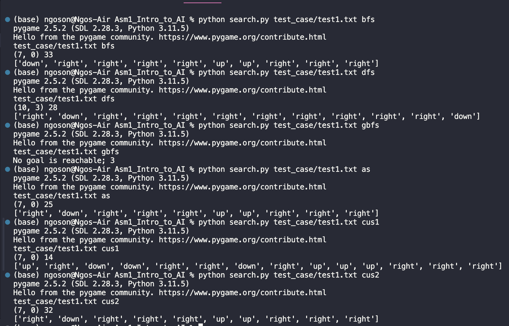
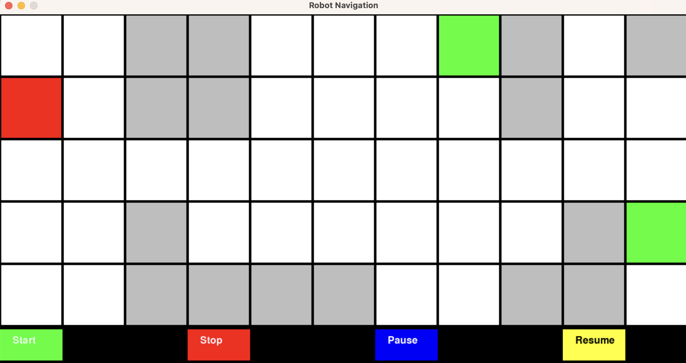

# COS30019-Intro-to-AI

## There are two programs in this repository:
1. Tree-based search visualisation
- This program has the purpose of illustrating and visualising tree-based search algorithms: breadth-first search, depth-first search, greedy best-first search and A-star. By using Python and Pygame library, I successfully made an illustration program.

- Specifically, it visualises how an agent navigates through a grid environment with obstacles, a starting point and many goals. For each
search algorithm, the agent will have a different way of searching. The program visualises the search according to how the agent navigates.

- To run the program, first install pygame: `pip install pygame`. Then, to start the program: type `python search.py <filename> <method>”`. <filename> is the directory of the data file you want to test the program on, and <method> is the search algorithm you want to implement. Make sure to type the command in the correct format and order.
  
- The result will be shown on the Terminal. It includes the coordinates of the goal found, the total number of states expanded by the program and the path from the starting point to the goal in a list of directions.

  
- In addition to the Terminal outputs, a GUI made by “pygame” will pop up.

2. Inference engine CLI
- Contribution thanks to @Stratton
